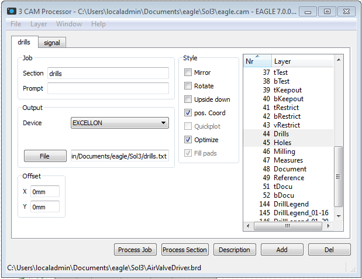

PCB2
=============

Workflow and scripts to support printed circuit board (PCB) milling with the Roland MDX-40A.

##Goal

We are trying to quickly prototype single and double layer PCBs using a CNC mill and software tools.  This repo uses a software tool chain composed of:
 - Eagle (Version 7.0.0 Lite)
 - PC-Board Cam (Version 8/10/2014)
 - Roland VPanel for MDX-40A
 - Custom Python scripts written by DAZL makers.

##Preparation

**MDX-40A**

1. Turn on the MDX-40A and open V-panel.  Some configutration is required before commencing to work through the tool chain.
2. Ensure that coordinate system G54 is selected.
3. Load the 1/64" square end mill and set the zero height using the touch sensor.
4. Click "Setup..." on VPanel.  
 - Ensure that "NC Code" is selected. 
 - Click on "NC Code Setting...".  Here you want to make sure that tab "Tool-diameter Offset" > No 1 is set to 1.57mm.  This represents the radius of the cutter used for boring holes larger than the biggest drill.  If you are not using the 1/8in square end mill for this task then you will need to change the value of "No 1" since it it the parameter added to scripts for circular interpolation tool diameter offset.  See tool diameter offset in the NC Code Reference for more details.

**Workpiece**

1. Clean the copper surfaces of the PCB blank using sandpaper.   You want to remove any oxidation prior to milling.
2. Optionally, you can tin the surface to make soldering easier after milling.
 - On 11/11 I used plumbers tinning flux applied with a cotton swab and then heated with our heat gun to tin the surface.  My initial impression is that this may have caused more bowing of the board than normal, but I will have to see if I like the soldering surface more than the cleaned copper.
3. Secure the workpiece in the jig.

##Workflow for single sided PCB

1. Produce a PCB design in Eagle using the DAZL parts library whenever possible.  Although Eagle make thousands of parts available through its installed libraries, only the DAZL parts have been "package" and "device" parameters that are designed to be cut with the drills and mills we use use at the DAZL.
2. Load the DAZL design rules.
3. Run Eagle's DRC and correct any errors.  This will ensure the signals, pads and vias in the design meet dimensional constraints that can be cut on the mill.

4. Run Eagle 'Cam Processor' and create two sections. 
  - The first section should contain your pads, vias, signal and dimension layers, and needs to be in Gerber-RS274X format.  
  - The second section should contain holes and drills and be stored in Excellon format.  
  - For standardization, I name these two files:
  - `<project path>/signal.gtl`
  - `<project path>/drills.txt` 
5. Once you have created these two sections click on File > Save Job... in the menu bar.  For standarization I use the following file name:
  - `<project path>/eagle.cam`
6. Now you want to output the files by clicking on "Process Job" in the cam processor window.
7. Launch PC-Board Cam and click on File > Open > New Circuit.  Load the `signal.gtl` file you just created in the Eagle Cam Processor.  
  - You may get a pop-up window on the Board dimensions.  Ensure that the check-box "Reframe around existing circuitry with a margin of _ _ _ mm" is checked  and contains the value 10mm.  We use this value becasue coordinate frame G54 we use on the MDX-40 has XY origin at (0,0).  We want the lower left corner of the PCB to be at (10,10) to ensure we have safe tool clearance between the hold-downs on the jig and most Southwest element on the PCB.  
  - Finally, the "Z thickness" block should reflect the thickness of your board.  We started with FR4 material that is 1.6mm thick so this will probably be in the default settings.  You may get a pop-up warning that the Z travel of the tools goes to about 1.9mm, and "do you want to change the depth cut of these tools".  Select "No" because we want the tools to cut all the way through into the sacrificial substrate.
8. Ensure there are no "Disabled" tracks that show up as brown signal paths.  
  - To "Re-activate" these tracks right click and select "Re-enable Track net".  
  - Small pads often go unnoticed as disabled at this stage so look closely.
  - Do NOT re-activate tracks around mounting holes and through-holes where heat sinks are mounted (i.e. for TO-220 packages that are screwed down).
9. For single sided boards consider flipping the file in PC-Board Cam on it's X axix.  This will allow you to install components on the substrate side of the board with through-hole components being soldered on the copper side.  Flipping the board makes neater and easier to solder boards.
10. There is a scaling error in the `drills.txt` file coming out of Eagle's cam processor that we correct with a custom script.  
  - Run the drill scaling command line script on the `drills.txt` output from Eagle.  
  - This will rescale the drill and hole locations to match the dimensions of the signal layer.
  - Make a note of the filename that the script prints upon completion.
11. Use the File > Open > Drills... menu option to load the modified drill file into PC-Board Cam.  This is not trivial.  
  - If you are asked to reduce the size of some drills to match their pads, choose "No".  
  - If you are asked if this is a valid import, choose, "Yes".
12. Often times the drill file needs to be rotated and/or flipped to match the signal layer.
  - To orient the drills and holes to the signal layer select Display > Drills in the menu bar.  Then use the rotation commands in PC-Board Cam to get the drill and hole orientation rotated the same as the signal layer.  
  - During this step the visual display of the drills and holes has a rendering bug that seems to make the holes disappear.  Click the "Reframe" button on the menu bar to render the drills again.  If this doesn't bring the holes back into visibility I have had to start over from step 7 on many occassions.  You should NOT need to run the drill reduce script more than once.
13. Next you will notice that the holes do not lay over their corresponding pads in the signal layer.  
  - Use the reference pads tool (bright pink circle targe in the toolbar) to align the two files.
  - Activate the signal layer and right click right click on a pad the select "Set as reference pad #1".
  - Then activate the drills layer and right click on the corresponding hole and select "Adjust to reference pad #1".
14. Click on the "Reframe" button.
15. Create a zero reference in the bottom left corner of the PCB.
  - Hover over the "Reframe" button and then select the "Origin" tool.  
  - Click "Plot Manually".
  - Then click the bottom left corner of the reframed card.
16. Now it's time to define the outline of the PCB.
  - Ensure the signal layer is activated.
  - Click Machine > Card contour > Define.
  - A small line will appear next to the cursor.  Click on the outline of the card that represents the dimension layer brought from the Eagle file.
  - You will be prompted to confirm that the highlighted track defines the card contour.  If things look good click "Yes".
  - Next you will get a popup window to "Set card contour".  Ensure the that the cut path radio button identifies "outside contour", unless your card also has interior cuts which are less common. 
  - Now click Maching > Card contour > Add cutting tabs... which will bring up another popup window.
  - Ensure that "Tab width: " is set to 2mm and click "OK".
  - Complete this step by adding four tabs to the card so that it will remain securely fastened in the mill while most of the material is cut free.  I usually put the tabs at the four cardinal direction making a mental note to avoid the places I know the jig hold-down clamps are touching the card.
17. Create the milling paths.
  - Select the signal layer (layer #1) and click on Machine > Calculate Contours. 
  - You will get another popup window to set a few parameters related to the milling path.  Ensure the settings match the included set contours image and click "OK".
  - Once the computer starts it will take a few minutes to complete.  I find that we need to Resolution > Medium in order to cut paths betwen all the small signals.
  - Closely inspect the results of this step to make sure all the important isolation cuts have yellow lines.  I think the optimization in the PC-Board Cam software is pretty awful.  It creates paths that are sometimes triple redundant and you will see it even more when the actual mill starts to cut.  However, the important thing at this stage is to ensure all paths have at least one yellow cut line.
18. Select tools for each milling operation
  - Click on Parameters > Selected Tools in the menu.  Ensure that the options match the tools image in this repo. 
19. Configure the output data from PC-Board Cam
  - Select Parameters > Output data format... in the menu.  Ensure the configuration options match the output image in this repo. 
20. Name the file where PC-Board Cam will store the milling code.
  - Input a file name in the text box next to the "Create File" radio button.  
  - Our mill does not make automatic tool changes so you will return to this screen and change the name for each milling operation.  I usually cut the signal layer first with the finest bit, and then proceed in the order below.  
  - For standardization use the following filenames:
    * Signal layer: `signal.txt`
    * Drills with #65 bit: `65_drill.txt`
    * Drills with #58 bit: `58_drill.txt`
    * Drills with #44 bit: `44_drill.txt`
    * Outline and circular boring on large holes: `cutline.txt`
21. It's time to export the code.  You will repeat this step for each milling operation.  The proper sequence of operations is:
  - Signal layer
  - Drills (an individual file for each drill size)
  - Outline (includes holes that are cut with cicular boring and the card countour)
  - For each file click Machine > Mill... in the menu bar.
  - This will open a popup window where you will select what to include in the file.  Only include one "section" in your files.  The one exception to this is that you will include both the circular boring tool AND the "cutting out" section for the final code file.
22. Make corrections to the code.The G-Code from PC-Board Cam runs on the Roland MDX-40A (or any other CNC mill). BUT...the output from PC-Board Cam has two problems that get corrected in post processing.
  - Integer values will cause errors on the MDX-40A.  Feed rates and X, Y and Z axis coordinates cannot be integer values(i.e. F60 X20 will cause and error).  Integer valued quantities must include a trailing zero(i.e. F60.0 X20.0).
  - Circular interpolation commands are used for circular boring of large holes.  However, PC-Board Cam does not seem to take advantage of G41 or G42 NC codes that compensate for the diameter of the cutter.  The result without compensation is that holes are too big.  We correct this in post-processing by adding these offset commands to the code file.
  - Run the post-processing script on the output files to to correct these issues.
23. Load the correct cutting tool into the mill, and reset the zero for the following conditions:
 - Any mill.  The mills are depth controlled and of variable length.  The zero must be reset for each mill that is loaded.
 - First drill bit.  Subsequent drill bits do not require the zero to be reset if they are all loaded where the depth ring is snugly against the collet.
24. Load the script into the mill and output the program through the mill using Roland's VPanel software.
25. Repeate this process from step 19 for each milling/drilling operation.
